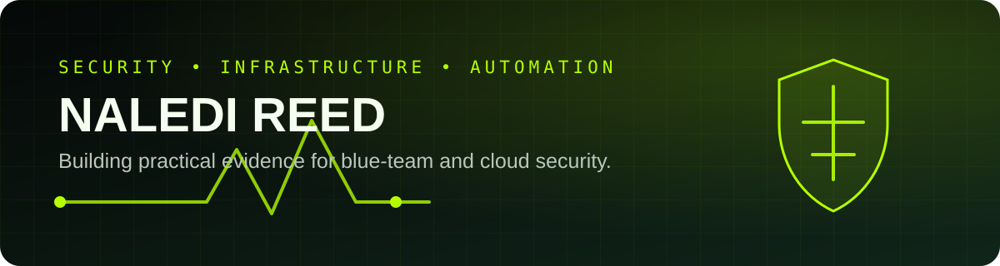

 

### Cybersecurity & Infrastructure Student

**SOC Operations • Windows & Linux • Networking • PowerShell • Cloud Security**

---

## 👋 About Me

I am a second-year **Diploma in Information Technology** student at **Belgium Campus iTversity**, following the **Infrastructure stream with a Security specialisation** and progressing toward final year in 2027.

I build practical evidence across Windows and Linux administration, networking, automation, containers and embedded systems. My career direction is **SOC analysis, blue-team security and cloud security**.

> This profile is designed as a technical workspace: open a project, inspect the source, review the evidence, or download the repository and run it yourself.

---

## 🟢 Start Exploring

---

## 🚀 Featured Projects

<b>🛡️ Hybrid Windows Infrastructure Lab</b> — identity, policy and security visibility

 

A Windows Server 2019 case study covering Active Directory, Group Policy, DNS, DHCP, file services and hardening. It includes a reusable, read-only PowerShell security-baseline exporter.

**Explore:** source script • execution guide • sanitised lab evidence • security-operations relevance

<b>⚡ PowerShell Administration Toolkit</b> — runnable Windows automation

 

A menu-driven toolkit for system discovery, process and service inspection, networking, disk reporting, event-log review, file searching and JSON export.

**Explore:** complete PS1 script • architecture • implementation notes • execution screenshots

<b>☁️ Cloud Native Student Qualifier</b> — C# and Docker

 

A C# console application that calculates a weighted semester result, applies exam-qualification rules and runs inside a Docker container.

**Explore:** C# source • project file • Dockerfile • CLI guide • test evidence

<b>🌐 Animated Lecturer Portfolio</b> — interactive front-end delivery

 

A responsive single-page website with animation, flip cards, a quote carousel, accessibility support and GitHub Pages deployment.

**Explore:** complete HTML/CSS/JavaScript • live deployment • collaboration record

---

## 🧪 More Technical Evidence

| Project | What you can open | Project stage |
|---|---|---|
| [Human Detection Probe](https://github.com/Naledi-Reed/human-detection-probe) | Arduino firmware, circuit schematic, Tinkercad diagram and technical summary | Functional prototype |
| [AquaSense IoT](https://github.com/Naledi-Reed/aquasense-iot) | Architecture, planning documents, risk register and design evidence | Concept case study |
| [Animated Lecturer Portfolio](https://github.com/Naledi-Reed/INL261-AI-Assisted-Animated-Website-) | Complete single-file web application and live demo | Complete |

---

## 🧰 Technical Toolkit

| Security & Infrastructure | Development & Automation |
|---|---|
| Windows Server, Active Directory, Group Policy | PowerShell, Bash, Python fundamentals |
| Linux administration and monitoring | C# and .NET |
| IPv4/IPv6, subnetting, DNS and DHCP | SQL and T-SQL |
| CyberOps and incident-response foundations | Docker, Git and GitHub |
| Identity, access and endpoint baselines | Arduino and embedded systems |

---

## 🎓 Credentials & Current Learning

**Earned:** Cisco CyberOps Associate • CCNA Introduction to Networks • Introduction to Cybersecurity • IT Essentials • Introduction to Data Science

**Developing:** AWS Cloud Practitioner • CompTIA Security+ • SOC investigation • Windows event analysis

---

## 🎯 2027 Direction

I am seeking **bursary, sponsorship, internship and learnership opportunities** related to:

---

## 🤝 Let's Connect

### Secure foundations. Practical evidence. Continuous growth.

